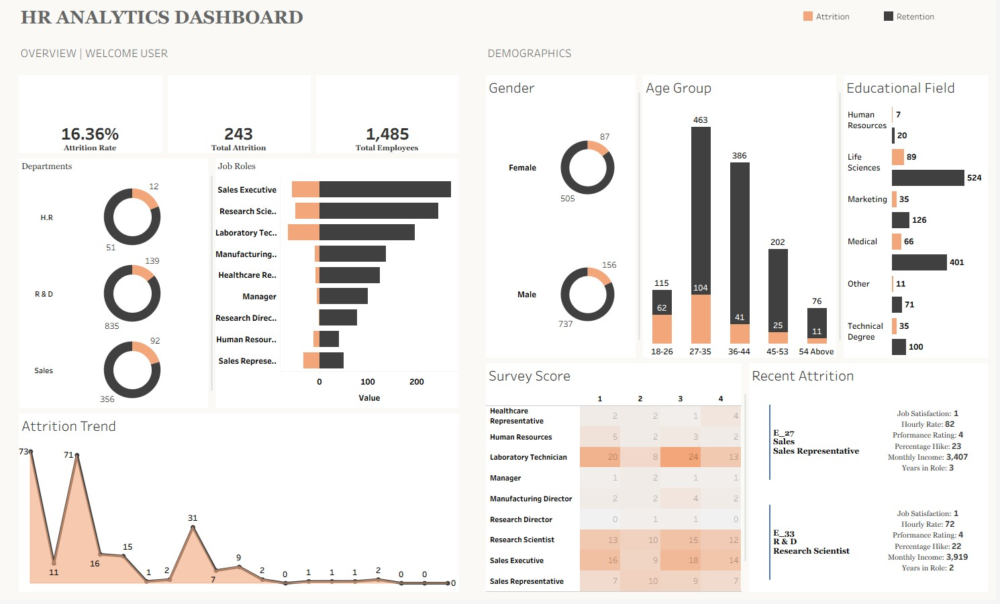
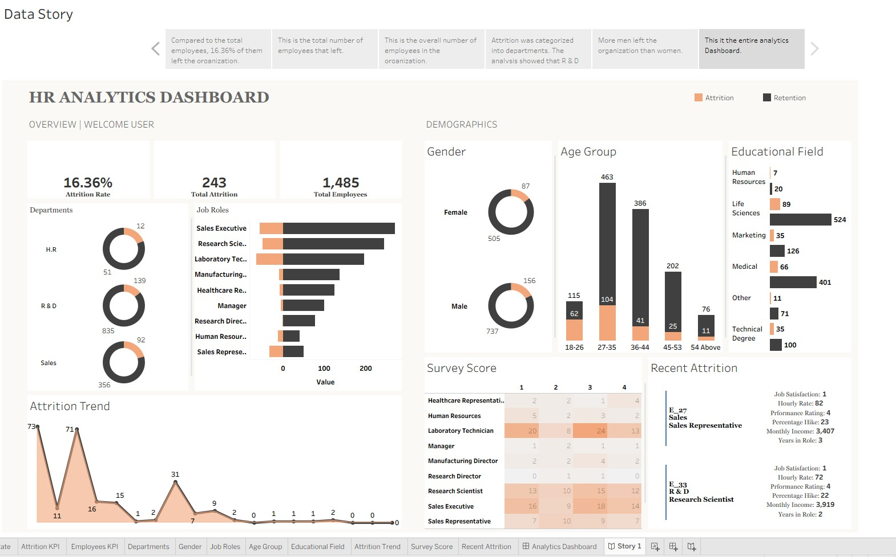
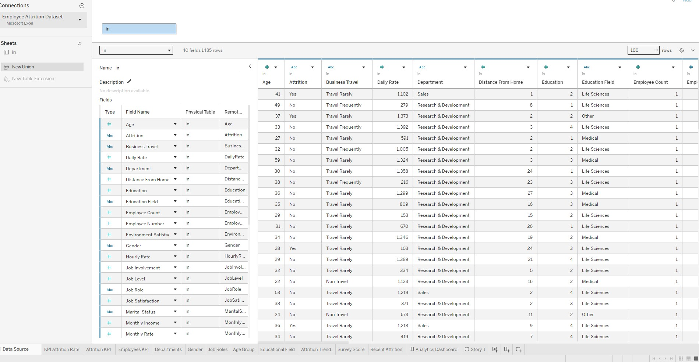

# 👥 HR Analytics Dashboard (Tableau)

> An interactive Tableau dashboard analysing employee attrition, retention, and workforce demographics across departments, job roles, age groups, and educational backgrounds.

---

## 📌 Project Overview

This project analyses HR data for a organisation of 1,485 employees, identifying attrition patterns and workforce composition across multiple dimensions. The dashboard provides HR managers with a single view covering overall attrition rates, departmental breakdowns, demographic profiles, survey scores, and recent attrition cases.

**Business questions answered:**
- What is the overall attrition rate and which departments are most affected?
- Which job roles experience the highest attrition vs retention?
- How does attrition vary across age groups, gender, and educational background?
- What do employee survey scores reveal about satisfaction by role?
- Which employees have recently left — and what were their key attributes?
- How has attrition trended over time?

---

## 📊 Dashboard

### HR Analytics — Overview

| Visual | Insight |
|---|---|
| KPI Cards | 16.36% attrition rate · 243 total attrition · 1,485 total employees |
| Donut — Attrition by Department | R&D highest attrition (139) · Sales (92) · H.R (12) |
| Bar — Attrition by Job Role | Sales Executive and Research Scientist show highest combined attrition and retention counts |
| Line — Attrition Trend | Peaks early (73, 71) then declines sharply — suggesting historical attrition has been addressed |
| Donut — Gender Breakdown | Female: 505 retained, 87 attrition · Male: 737 retained, 156 attrition |
| Bar — Age Group Distribution | 27–35 is the largest group (463 retained, 104 attrition) · 54+ smallest cohort |
| Bar — Educational Field | Life Sciences dominates (524 retained, 89 attrition) · Human Resources smallest field |
| Heatmap — Survey Scores by Role | Laboratory Technician shows highest attrition concentration (scores 1–3) · Research Scientist scores spread across all bands |
| Card — Recent Attrition | Detailed profile cards for recently departed employees showing satisfaction, income, performance, and tenure |
| Legend | Orange = Attrition · Dark = Retention — consistent across all visuals |

### Tableau Data Story

A **Tableau Data Story** was built alongside the dashboard — a guided narrative walkthrough that automatically generates plain-language insights from the data. The story steps through key findings sequentially:

1. 16.36% of total employees left the organisation
2. Total number of employees that left (243)
3. Overall employee headcount (1,485)
4. Attrition breakdown by department — R&D identified as the most affected
5. Gender attrition comparison — more men left than women
6. Full analytics dashboard as the final story point

This feature demonstrates the ability to communicate data findings to non-technical stakeholders without requiring them to interact with the dashboard directly.

---

## 🗄️ Dataset

Source: **Employee Attrition Dataset** (Microsoft Excel) — **40 fields, 1,485 rows**, connected directly in Tableau Desktop. The workbook contains 10 individual sheets feeding the dashboard (KPI Attrition Rate, Attrition KPI, Employees KPI, Departments, Gender, Job Roles, Age Group, Educational Field, Attrition Trend, Survey Score, Recent Attrition) plus the Analytics Dashboard and Data Story.

| Field | Type | Description |
|---|---|---|
| `Age` | Number | Employee age |
| `Attrition` | Text | Yes / No — whether employee has left |
| `Business Travel` | Text | Travel frequency (Travel Rarely, Travel Frequently, Non Travel) |
| `Daily Rate` | Number | Daily pay rate |
| `Department` | Text | Sales, Research & Development, Human Resources |
| `Distance From Home` | Number | Commute distance in miles |
| `Education` | Number | Education level (1–4 scale) |
| `Education Field` | Text | Life Sciences, Medical, Marketing, Technical Degree, Human Resources, Other |
| `Employee Count` | Number | Headcount per record (all 1) |
| `Employee Number` | Number | Unique employee identifier |
| `Environment Satisfaction` | Number | Satisfaction with work environment (1–4) |
| `Gender` | Text | Male / Female |
| `Hourly Rate` | Number | Hourly pay rate |
| `Job Involvement` | Number | Level of job involvement (1–4) |
| `Job Level` | Number | Seniority level |
| `Job Role` | Text | Sales Executive, Research Scientist, Laboratory Technician, etc. |
| `Job Satisfaction` | Number | Job satisfaction score (1–4) |
| `Marital Status` | Text | Single, Married, Divorced |
| `Monthly Income` | Number | Monthly salary |
| `Monthly Rate` | Number | Monthly pay rate |

> *Additional fields visible in the dataset include Performance Rating, Percentage Hike, Years in Role, Years at Company, and other tenure/compensation metrics used in the Recent Attrition cards.*

---

## 🛠️ Tools & Techniques

- **Tableau Desktop** — dashboard design, calculated fields, interactive filters
- **Calculated fields** — attrition rate, retention count, attrition count derived from raw HR data
- **Donut charts** — department and gender attrition/retention split
- **Heatmap** — survey satisfaction scores by job role and rating band (1–4)
- **Grouped bar charts** — age group and educational field breakdowns with attrition/retention colour encoding
- **Line chart** — attrition trend over time
- **Detail cards** — recent attrition employee profiles surfacing job satisfaction, hourly rate, performance rating, pay increase, income, and tenure
- **Colour encoding** — consistent orange (attrition) vs dark grey (retention) legend applied across all chart types
- **Tableau Data Story** — auto-generated narrative walkthrough presenting key findings in plain language for non-technical stakeholders
- **Multi-sheet workbook** — 10 individual sheets (KPI views, demographic breakdowns, trend analysis, survey scores, recent attrition) feeding a single consolidated dashboard

---

## 💡 Key Findings

- **Attrition rate of 16.36% is above the typical industry benchmark** of 10–12% for most sectors — indicating a retention problem worth addressing strategically
- **R&D bears the heaviest attrition burden** at 139 employees — nearly 60% of all attrition — making it the department most in need of targeted retention efforts
- **Laboratory Technicians show the most concerning survey pattern** — concentrated low satisfaction scores (1–3) alongside high attrition counts; dissatisfaction appears to be a direct driver
- **The 27–35 age group is both the largest workforce cohort and the highest attrition group** — losing mid-career talent at this stage is costly given training investment and institutional knowledge
- **Male employees account for 64% of attrition (156 vs 87)** — though this broadly reflects the gender composition of the workforce; proportional attrition rates by gender would require further analysis
- **Life Sciences is the dominant educational background** for both retained and departing staff — suggesting hiring is concentrated in this field, and retention strategies should be tailored accordingly
- **The attrition trend line shows a sharp historical decline** from peaks of 73 and 71 down to near-zero — suggesting past interventions have worked, but recent small upticks (31, 15, 16) may warrant monitoring
- **Recent attrition profiles reveal low job satisfaction (score: 1)** combined with low monthly income ($3,407–$3,919) and high performance ratings (4) — high performers leaving due to pay is a classic and avoidable retention failure

---

## 🔗 Live Dashboard

**[👉 View the interactive dashboard on Tableau Public](https://public.tableau.com/views/AttritionDashboard_17869967929700/AnalyticsDashboard?:language=en-GB&:sid=&:redirect=auth&publish=yes&showOnboarding=true&:display_count=n&:origin=viz_share_link)**

> Fully interactive — hover over any visual for detailed tooltips, and use filters to explore attrition patterns by department, role, or demographic.

---

## 📁 Files in This Repository

| File | Description |
|---|---|
| `HR_Analytics.jpg` | Screenshot — full dashboard overview |
| `HR_Analytics_Data_table.jpg` | Screenshot — Tableau data source with 40 fields, 1,485 rows |
| `HR_Analytics_Datastory.jpg` | Screenshot — Tableau Data Story narrative walkthrough |

---

## 👤 Author

**Divine Abbah** — Data Analyst  
📧 divineabbah7@gmail.com  
🌐 [LinkedIn](https://linkedin.com/in/divineabbah)
